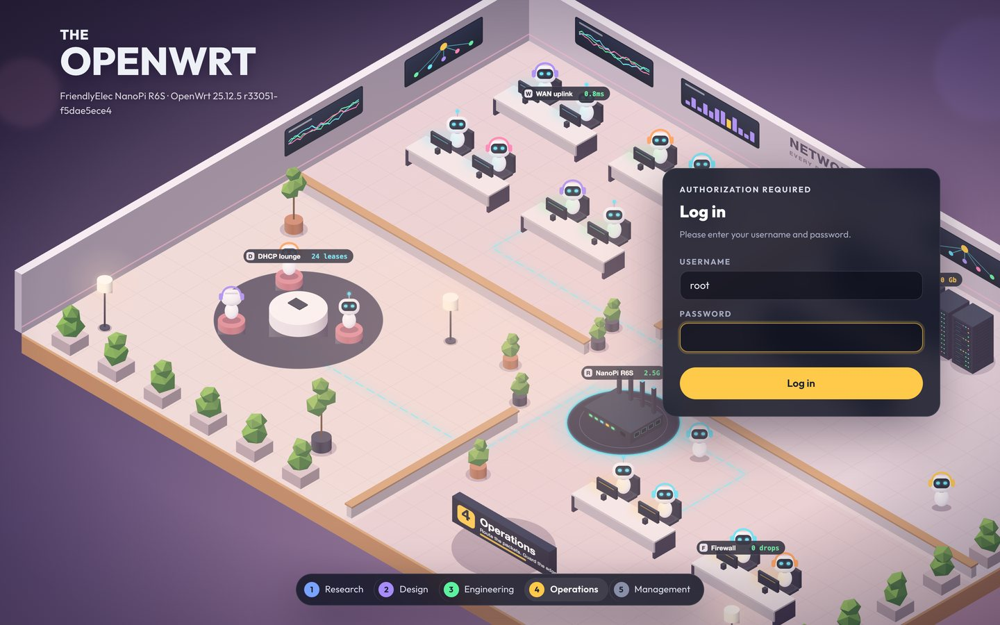
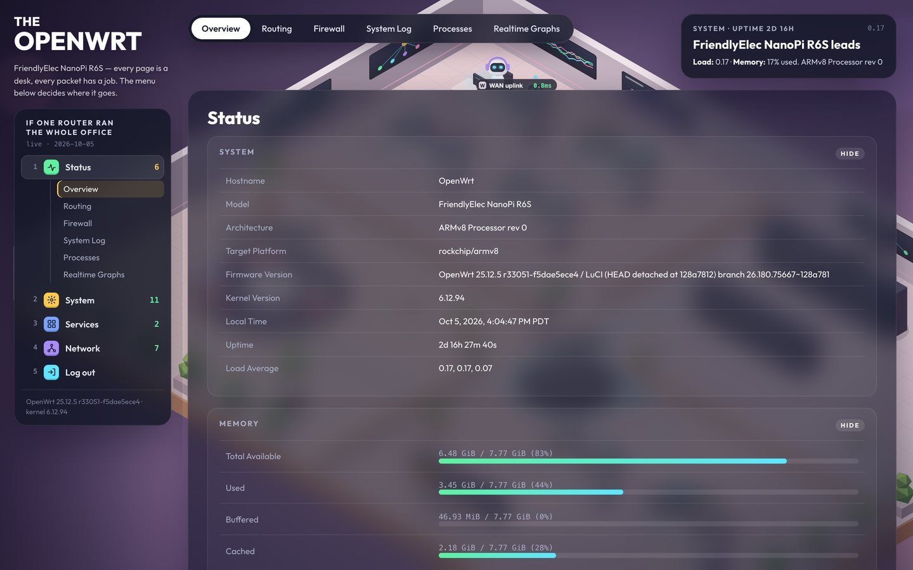
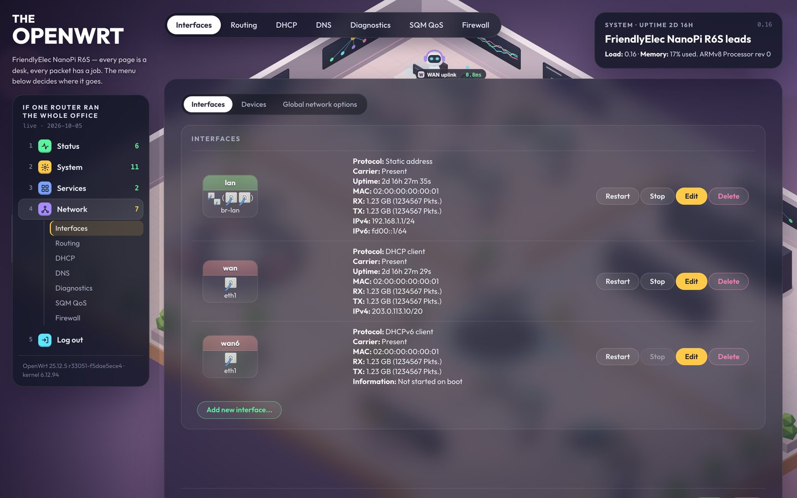
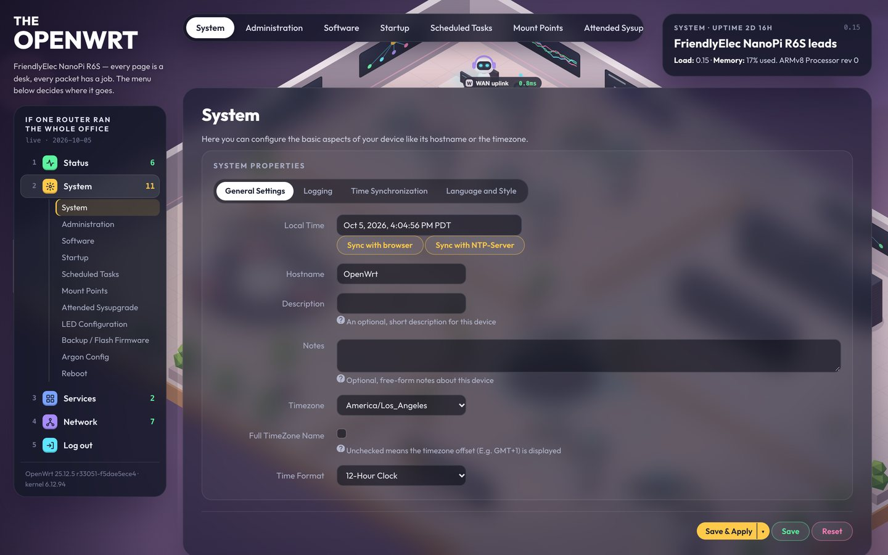
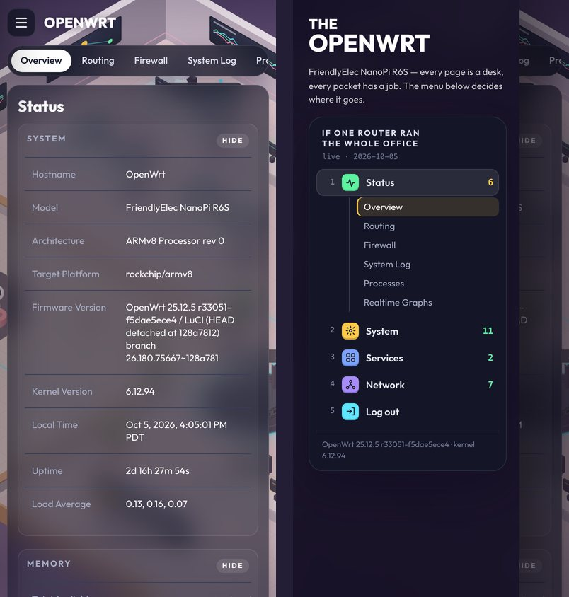

# luci-theme-office

An isometric, glass-panel LuCI theme for OpenWrt. Every page is a desk, every packet has a job.

一个等距 3D 办公室风格的 OpenWrt LuCI 主题：深色毛玻璃面板 + 低多边形机房背景。



| Overview | Network |
| --- | --- |
|  |  |

| System | Mobile |
| --- | --- |
|  |  |

## Features / 特性

- Isometric "network office" background (pure SVG, ~230 KB, generated by `tools/gen_bg.py`)
- Sidebar "leaderboard" menu, pill tab bar, numbered step bar, live system info card
- Glass styling for all LuCI widgets: forms, tables, dropdowns, modals, progress bars, interface boxes
- Responsive: off-canvas sidebar on phones
- No external requests: font (Outfit) is bundled
- 侧边排行榜菜单、顶部胶囊导航、底部步骤条、实时系统信息卡；手机端适配；不依赖任何外网资源

## Requirements / 要求

OpenWrt **23.05 or newer** (ucode-based LuCI). Tested on OpenWrt 25.12.5 (NanoPi R6S).

## Install / 安装

**Option 1 — package / 安装包**

Download the package for your release from [Releases](../../releases) (`.apk` for 25.12+, `.ipk` for 24.10 and older), upload it to the router, then:

```sh
apk add --allow-untrusted luci-theme-office-*.apk   # OpenWrt 25.12+
opkg install luci-theme-office_*.ipk                # OpenWrt 24.10 / 23.05
```

**Option 2 — one-line script / 一键脚本**

```sh
wget -qO- https://raw.githubusercontent.com/weijianz-opc/luci-theme-office/main/install.sh | sh
```

**Option 3 — build from source / 源码编译**

```sh
git clone https://github.com/weijianz-opc/luci-theme-office package/luci-theme-office
make menuconfig   # LuCI -> Themes -> luci-theme-office
make package/luci-theme-office/compile V=s
```

The theme becomes the default after install. Switch themes in **System → System → Language and Style**.

安装后自动设为默认主题，可在「系统 → 系统 → 语言和界面」中切换。

## Uninstall / 卸载

```sh
apk del luci-theme-office      # or: opkg remove luci-theme-office
# installed via script:
wget -qO- https://raw.githubusercontent.com/weijianz-opc/luci-theme-office/main/install.sh | sh -s uninstall
```

## Customize the background / 自定义背景

```sh
python3 tools/gen_bg.py   # writes htdocs/luci-static/office/bg.svg
```

Edit the scene section of `tools/gen_bg.py` (desks, racks, plants, labels, colours) and re-run.

## Credits / 致谢

- Visual style inspired by the "The AI Office" isometric web showcase.
- `base.css` / `mobile-base.css` are derived from [luci-theme-bootstrap](https://github.com/openwrt/luci/tree/master/themes/luci-theme-bootstrap) (Apache-2.0).
- [Outfit](https://github.com/Outfitio/Outfit-Fonts) font, SIL Open Font License 1.1 (`htdocs/luci-static/office/fonts/OFL.txt`).

## License

Apache-2.0, see [LICENSE](LICENSE). The bundled font is licensed under OFL-1.1.
